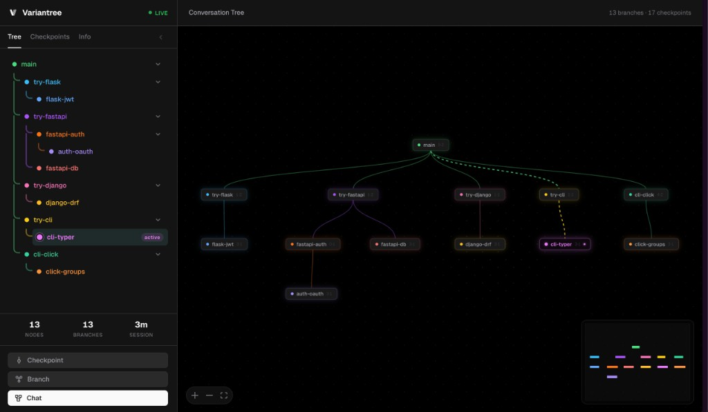

<p align="center">
  
</p>

<h1 align="center">Variantree</h1>

<p align="center">
  <strong>The first AI-native version control. Branch, checkpoint, and switch — your AI handles the rest.</strong>
</p>

<p align="center">
  <a href="#installation">Install</a> · <a href="#example-session">Demo</a> · <a href="#why-variantree">Why?</a> · <a href="#how-variantree-is-different">vs. alternatives</a> · <a href="#packages">Packages</a>
</p>

<p align="center">
  <video src="assets/variantree.mp4" autoplay loop muted playsinline width="800"></video>
</p>

---

AI coding tools give you a linear undo history. Variantree gives you a **tree**. Each branch keeps its own code snapshot *and* conversation ancestry — when you switch, the AI picks up exactly where it left off. No re-reading files, no re-explaining decisions. This cuts context size by **58.1%** and eliminates the quality degradation that comes with bloated conversation windows [[1]](#ref-1).

Works via [MCP](https://modelcontextprotocol.io) — your AI uses it automatically. Supports Claude Code and OpenCode.

---

## The problem

Every exploratory tangent you take stays in your AI's context forever. That's not just expensive — it makes the AI worse. Models lose **30%+ accuracy** when key information is buried mid-context [[3]](#ref-3), degrade **up to 85%** as input grows [[4]](#ref-4), and agentic runs vary by **10×** in cost for the same task [[7]](#ref-7).

Branching isolates each exploration into its own context. The result: **58.1% less context**, **39% less quality degradation** [[1]](#ref-1).

---

## How Variantree is different

|  | Variantree | Claude Code `/rewind` | Cursor checkpoints | `git worktree` |
|---|---|---|---|---|
| Named, AI-authored checkpoints | ✅ | ❌ (anonymous) | ❌ (anonymous) | ❌ (commits) |
| Branching tree, not linear undo | ✅ | ❌ | ❌ | ✅ |
| Conversation ancestry on switch | ✅ | ❌ | ❌ | ❌ |
| Captures external edits (bash, editors) | ✅ (full git snapshot) | ❌ (tool edits only) | ❌ (tool edits only) | ✅ |
| Doesn't pollute `git log` | ✅ (hidden refs) | n/a | n/a | ❌ |
| Cross-tool (Claude Code + OpenCode) | ✅ | ❌ | ❌ | n/a |

If you've used `/rewind` and wished it had *names*, *branches*, and *conversation memory* — that's Variantree.

---

## Why Variantree

### Save tokens, not money

Every time you ask an AI to "go back" or "try the other approach," it has to re-read your entire codebase and re-establish context from scratch. That's thousands of wasted tokens per switch. Variantree stores the full conversation history per branch — when you switch, the AI picks up exactly where it left off with zero redundant context. Over a session with multiple explorations, this adds up to **significant token savings**.

### Automatic agent checkpointing

You don't have to remember to save. Variantree's standing instructions tell the AI to checkpoint after completing tasks, before risky changes, and before branching. The AI does it proactively — your code and conversation are always recoverable without you lifting a finger.

### Fearless exploration

Want to try a class-based rewrite? A different algorithm? A complete architectural pivot? Branch off, explore freely, and switch back in one sentence. Every branch preserves its own code state and conversation, so you never lose work and the AI never loses context.

### Full conversation continuity

Other tools restore files. Variantree restores *understanding*. When you switch branches, the AI gets the complete conversation ancestry for that branch — every decision, every rationale, every prior instruction. It doesn't just see the code; it knows *why* the code looks the way it does.

### Zero friction

Install once, and it works. No manual init, no config files to write, no commands to memorize. The MCP server registers itself globally, project instructions are written on the first tool call, and the AI handles checkpointing and branching through natural conversation.

---

## How it works

Traditional version control is built for humans running commands. Variantree is built for AI:

- The AI **checkpoints** after completing a task — saving both the code and the conversation
- The AI **branches** when you want to try a different approach — without losing where you were
- The AI **restores** or **switches** when you want to go back — and gets the full prior conversation context automatically
- You just talk. The AI handles the rest.

---

## Installation

```bash
sudo npm install -g @variantree/watcher@latest
```

That's it — one package for all supported tools. The installer automatically registers the Variantree MCP server in the global config for **both OpenCode and Claude Code**. Open any project and start chatting — Variantree activates on the first tool call.

| Tool | What gets configured |
|---|---|
| [OpenCode](https://opencode.ai) | `~/.config/opencode/opencode.json` → `mcp.variantree` |
| [Claude Code](https://claude.ai/code) | `~/.claude.json` → `mcpServers.variantree` |

To update to a newer version, just run the same command again — it overwrites the old version and refreshes the MCP config.

> **Requirements:** Node.js 18+

---

## Example session

```
You:  Build a todo app with add, remove, and list functions

AI:   [writes index.ts]
      Created index.ts with add(), remove(), list() functions.

You:  Save a checkpoint

AI:   ✓ Checkpoint "todo-basic" created.
        Messages synced: 4 new  (4 total in context)
        Snapshot: 1 file

You:  Branch off and rewrite it using a class, call it class-based

AI:   ✓ Branch "class-based" created from "todo-basic" and switched to it.
        Restored: 1 file written.
      [rewrites index.ts as a TodoApp class]

You:  Switch back to main

AI:   ✓ Switched to branch "main".
        Restored to checkpoint "todo-basic": 1 file written.
        [original function-based code is back]

You:  Show me the tree

AI:   ⎇ main (4 msgs)
        └── ◆ todo-basic
              └── ⎇ class-based (2 msgs) ●
                    └── ◆ class-v1

You:  Show me the tree visually

AI:   [opens interactive React Flow tree in browser at http://127.0.0.1:PORT]
      Opened interactive tree visualization.
```

---

## What the AI can do

> Unlike `/rewind` or `/checkpoint` in Claude Code (which are unnamed, auto-generated undo points on a linear timeline), every tool below is **AI-driven** — the AI decides when to use them, names things meaningfully, and manages a branching tree, not just a flat history.

#### `checkpoint` — Named save points, not anonymous undo

The AI creates checkpoints at meaningful moments — after finishing a feature, before a risky refactor, when you say "this looks good." Each checkpoint has a human-readable label (`"auth-complete"`, `"pre-migration"`) and captures a **full Git snapshot** of every tracked file, including changes from bash commands and external editors. Claude Code's built-in checkpoints only capture its own tool edits and have no names.

#### `branch` — Parallel worlds, not linear history

Create a new timeline from any checkpoint. The AI forks the conversation and restores the code to that exact state. Work on `graphql`, `rest-api`, and `grpc` branches simultaneously — each one isolated, each with its own conversation history. No other AI tool offers this.

#### `switch` — Change timelines with full memory

Jump between branches in one sentence. The AI doesn't just restore code — it loads the **complete conversation ancestry** for that branch. It remembers every decision, every rationale, every prior instruction from that timeline. Other tools restore files; Variantree restores *understanding*.

#### `restore` — Rewind without losing your place

Roll back code to any checkpoint while staying on the current branch. The conversation continues forward, but the code is exactly as it was at that save point. Think of it as "undo to here" without discarding your branch.

#### `status` — Instant orientation

Shows the active branch, message count, all branches, and all checkpoints at a glance — so the AI always knows where it is in the tree without scanning files or re-reading history.

#### `tree` — See everything at once

An ASCII visualization of your entire exploration tree — branches, checkpoints, active position, message counts. No other tool gives you a bird's-eye view of your AI session's decision history.

```
main (12 msgs) ●
  └── auth-complete ◆
        ├── try-graphql (6 msgs) ●
        │     └── schema-done ◆
        └── try-rest (4 msgs)
              └── endpoints-done ◆
```

#### `tree_web` — Interactive visual tree in the browser

Opens the full React Flow web UI in your default browser, pre-loaded with your project's real workspace data. Drag, zoom, and explore all branches and checkpoints interactively.

<p align="center">
  
</p>

#### `log` — Full conversation replay

Retrieve the complete conversation history for any branch. Useful when the AI needs to recall a specific decision or re-read prior context without it being in the active context window.

The AI is instructed to use these proactively — after completing tasks, before risky changes, and whenever you ask to explore alternatives.

---

## How context works

When you branch or switch, Variantree doesn't just restore files — it reconstructs the full conversation ancestry for that branch and writes it to `.variantree/branch-context.md`. The AI reads this at the start of each session, so it always knows the history of the branch it's on, even after a restart.

Branches are linked: if `class-based` was created from `todo-basic` on `main`, the AI on `class-based` has access to all of `main`'s conversation up to `todo-basic`, plus everything that happened on `class-based` after.

---

## Packages

This is a monorepo with four packages:

| Package | Install? | Description |
|---|---|---|
| [`@variantree/core`](packages/core) | No | Core engine — workspace, branch, checkpoint, and context logic |
| [`@variantree/watcher`](packages/watcher) | **`npm i -g`** | CLI + adapters for OpenCode \& Claude Code. Auto-registers MCP on install. |
| [`@variantree/mcp`](packages/mcp) | No | MCP server binary — invoked automatically by AI tools. Bundles the web UI. |
| [`@variantree/web`](packages/web) | No | React + React Flow web UI — served locally by `tree_web` / `tree --web`. |

### CLI

Installing `@variantree/watcher` globally also gives you the `variantree` CLI:

```bash
variantree status          # show current branch and checkpoints
variantree checkpoint      # save a checkpoint interactively
variantree branch <name>   # create a new branch
variantree switch <name>   # switch to an existing branch
variantree restore <label> # restore code to a checkpoint
variantree tree            # show the branch/checkpoint tree (ASCII)
variantree tree --web      # open interactive tree visualization in browser
variantree log             # show conversation history
variantree init            # manually set up a project (usually not needed)
```

---

## Under the hood

- **Checkpoints** are stored as Git commits in a hidden ref namespace (`refs/variantree/`), leaving your own Git history completely untouched.
- **Conversation messages** are read from OpenCode's SQLite database and synced into Variantree's workspace on every tool call.
- **Session tracking** pins each Variantree workspace to a specific OpenCode session ID, so messages from old sessions at the same path are never re-imported.
- **Branches** store only their delta messages; the full context is reconstructed by walking the parent checkpoint chain.

---

## References

Variantree is grounded in a growing body of research on long-context degradation, agentic coding cost, and conversation branching:

**Context branching and tree architectures**
1. <a id="ref-1"></a>Chickmagalur Nanjundappa & Maaheshwari (2025). *Context Branching for LLM Conversations: A Version Control Approach to Exploratory Programming.* [arXiv:2512.13914](https://arxiv.org/abs/2512.13914) — 58.1% context reduction, 39% multi-turn quality drop.
2. <a id="ref-2"></a>*Conversation Tree Architecture: A Structured Framework for Context-Aware Multi-Branch LLM Conversations.* [arXiv:2603.21278](https://arxiv.org/html/2603.21278) — independent validation of tree-structured conversations with branch/merge semantics.

**Long-context degradation**
3. <a id="ref-3"></a>Liu et al. (Stanford, 2023). *Lost in the Middle: How Language Models Use Long Contexts.* [arXiv:2307.03172](https://arxiv.org/abs/2307.03172) — U-shaped performance curve; 30%+ drop when info is mid-context.
4. <a id="ref-4"></a>*Context Length Alone Hurts LLM Performance Despite Perfect Retrieval* (2025). [arXiv:2510.05381](https://arxiv.org/html/2510.05381v1) — 13.9%–85% degradation within claimed context windows.
5. <a id="ref-5"></a>*LLMs Get Lost In Multi-Turn Conversation.* [arXiv:2505.06120](https://arxiv.org/pdf/2505.06120) — explicit multi-turn quality degradation.
6. <a id="ref-6"></a>[Context Rot — Chroma Research](https://research.trychroma.com/context-rot) — reliability decays non-uniformly as input grows.

**Agentic coding token economics**
7. <a id="ref-7"></a>*How Do Coding Agents Spend Your Money? Analyzing and Predicting Token Consumptions in Agentic Coding Tasks.* [OpenReview](https://openreview.net/forum?id=1bUeVB3fov) — 10× run-to-run variance, input tokens dominate cost.
8. <a id="ref-8"></a>*Tokenomics: Quantifying Where Tokens Are Used in Agentic Software Engineering.* [arXiv:2601.14470](https://arxiv.org/pdf/2601.14470) — stage-by-stage token profiles.
9. <a id="ref-9"></a>[Efficient Context Management — JetBrains Research (Dec 2025)](https://blog.jetbrains.com/research/2025/12/efficient-context-management/) — observation masking vs. summarization as the two main paths.

---

## License

[Apache License 2.0](LICENSE)
